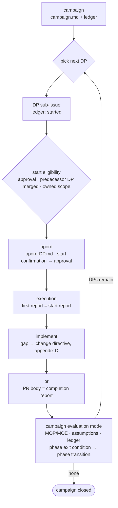

# Campaign — Writing and Evaluating the Campaign Plan

## 1. Overview

**campaign.md is the plan for L-size work (several PRs).** The template is `${CLAUDE_PLUGIN_ROOT}/templates/campaign.md` — no prose outside the items; fill inapplicable items with "none". **Volume is set by the format**: four-part `■ Abstract` at the head, a history item at the very end, table cells within three lines, no revision-number citations in the body — the usage notes at the bottom of the template are authoritative. "Be concise" is unjudgeable and did not work. What shrinks is sentences and **discarded history**, never the decisions or information to be carried — history is not thrown away, it moves down to the history item. Sentence norms are governed by the host project's writing norms (absent host norms, the reviewer's judgment applies) — terseness operates within those requirements. Terms (DP, LOE, FRAGO, MOP/MOE, PIR/FFIR, branch/sequel) are defined in the template's terms line.

The host's operations directory (default `docs/operations/`, overridable in the host's `CLAUDE.md`) holds the plan and progress files this skill reads and writes; below it is called "the operations directory". See `docs/extension-points.md` for the host contracts.

- Entry is two-way — delegation from intake's size judgment (L/XL), or the user's direct call. **If the host has an intake skill and it has not run, invoke it first; otherwise proceed from the issue body** (pre-research belongs to intake — do not re-implement it here).
- This plan stands in for the decomposition brief — item 9 (DP list) is the listing, and the undecided list is the "undecomposed remainder".
- The plan file is `<operations directory>/<parent issue>/campaign.md` and is **not committed to git** (the host gitignores the operations directory). The canonical sharing is the issue-body mirror (and any status display the host keeps); other sessions and worktrees restore from the issue body — committing would add worktree and integration-branch sync cost on every revision. The DP base is set by the host's orchestration skill (if any); otherwise it is the integration branch or the preceding DP branch. Issue body = this file in full + the `<!-- progress -->` block (§5).
- **Resolution boundary — campaign goes down to the DP level only.** Even a branch goes only as far as "DP rearrangement, substitution, or scope reduction". Task-level decision points and exception responses belong to opord — going below that duplicates opord and bloats this document.

**L execution loop** — this skill owns only the two ends of the loop (planning and evaluation):

M is intake → opord → implement → pr, S is intake → verbal order → implement → pr. XL runs the loop above for each campaign in strategy.md.

## 2. Authoring mode

1. **Derive situation and tasks** — reuse the intake pre-research to fill item 1 (pre-research summary; the most likely and most dangerous forms of the obstacle); if insufficient, use a code-analysis subagent.

   This skill expects the pre-research brief as input. It is provided by the host project's intake skill (a later stage of this plugin ships a default).

   Then derive tasks: **stated** (what the release plan or issue body asks for) / **implied** (not stated, but pulled in by the host's rules or architecture — paired locations, test targets, localization keys, and the like) / **mandatory** (stated or implied tasks whose omission directly misses the end state). Whether every derived task has a DP coordinate is the check standard for item 9 — an implied task left out of the plan keeps swelling into FRAGOs during execution. **If no doctrine for attaching an implied task exists in the host's rules or precedent, ask the host to build the rule** (through whatever rule-authoring process it has) — the plan does not stop; carry the request into the question round in step 2.
2. **Ask in plan-conception order**: release plan → problem definition → closing and stopping criteria → end state → core obstacle → approach → work lines → phases → work order → DPs, owned scope, interface contracts → decision points and branches → assumptions, risks, handling limit → resources → evaluation indicators. Attach a default and ask **in one batch** with AskUserQuestion — ask only what changes the plan depending on the answer. Do not ask what pre-research (intake exploration) can find out. **Include the pre-research brief's "only the user can answer" undecided list in the questions** (this is where they get settled, not in intake) — settle campaign-level decisions here; do not settle DP-level undecided items, put them in the undecided list and hand them to that DP's opord.
3. **COA comparison — do not start from a single decomposition.** Sketch two or more decompositions that differ in LOE composition, phasing, or arrangement, and present those that pass screening with trade-offs for the user to choose — suitable (covers every aspect of the end state) · feasible (runs within the item 13 resources) · acceptable (risk within tolerance) · distinct (the approaches actually differ) · complete (every mandatory task has a DP coordinate). If only one feasible decomposition truly exists, go with a single option and write the reason — the choice rationale is recorded in the "approach" of item 5 (core obstacle analysis).
4. **Consistency check on every draft**: aspect of the end state with no owner / overlapping owned scope / resource conflict / time-based condition (exit condition is a point in time, not a state) / phase name that is a work nature, not a phase / DP size (finishes in days as one PR) / predecessor dependency / MOE≠MOP / core obstacle reflected / immediate-report condition with no decision point / high-risk phase transition with no branch / parallel bundle with no rationale / no closing or stopping criteria / MOE with no indicator / mandatory task with no coordinate. If any one hits, go back to that item.
   **The volume check runs together** — are the four abstract parts all filled / does a table cell exceed three lines / do revision-number citations remain in the body / does the header revision line exceed one sentence. Move overflow to the history item, leaving only what is currently settled. Count lines; do not eyeball.
5. **Scenario check** — after the draft is complete, before posting. Walk the DPs in phase order, and for each assumption (item 11), risk (item 12), and constraint (item 16) confirm "in the scenario where this breaks, which decision point or branch absorbs it". If a scenario nothing absorbs turns up, reinforce items 8 and 10–12 and walk again — decision points, branches, and arrangement are outputs of this scenario check, not cells to fill from the head.
6. **Output**: save `campaign.md` + issue-body mirror (§5) + the undecided list. **Fill the abstract last, after the full text is written** — writing it first leaves draft-stage intent that drifts from the final text. Generate the item 8 flowchart (mermaid) from the tables, based on the final arrangement after the scenario check — GitHub renders it in the issue mirror. **Do not decide the work lines or end state on the user's behalf** — staff help fill them in; the decision is the user's.
7. **Post the draft**: when the draft is complete (awaiting approval), first reassemble the issue-body mirror (§5 rules — draft in full + `<!-- progress -->` block) — the plan file is not committed, so the issue body is the only place the user reads on GitHub. Then post the gist and file path on the parent issue as an issue comment through the host's notification channel (`report-posted` extension point; default: a plain issue comment) — the posting criterion is the moment the session stops because a user action is needed. Campaign plans and release plans have no matching report template, so their posting rule lives here directly.

   > Extension point: `report-posted` fires here. See `docs/extension-points.md`.

   Before posting, **check whether a first-review session has been designated** — look at two places: the user's instruction, and the controlling-session line of the parent strategy.md (§3). If one is designated, send it to that session first and get plan-review passed; if none, write the fact that none is designated in item 4 of the approval summary — revisions too (the reason for writing down the check result is opord §3-8). **A response asking the user for approval after posting follows the approval summary format in opord §3** (decisions for approval · mission and end state · scale and user time · first review) — do not duplicate the format here. Campaign writes the DP count in the scale item, and for a revision puts the changed items in the decisions item.

- A DP is mandatorily issue = PR — the ledger's issue # cell is always filled, and commits carry `[#DP issue]`. DP issue creation happens at the issue step of the loop, on the user's instruction.
- Delegation inherits `${CLAUDE_PLUGIN_ROOT}/templates/delegation.md` — the plan records only what narrows it (item 15).

## 3. XL release-plan mode

When two or more campaigns share one purpose, fill **every item** of `${CLAUDE_PLUGIN_ROOT}/templates/strategy.md` and save it as `<operations directory>/<issue>/strategy.md` (uncommitted as in §1 — the canonical sharing is the issue-body mirror). Apply the authoring-mode procedure unchanged, at the release-plan level: questions (purpose → end state → closing and stopping → means, constraints, and ends-ways-means-risk consistency → delegation → campaign list and arrangement → assumptions, risks, handling limit → decision points → evaluation); a COA comparison if the campaign arrangement forks; after the draft, a scenario check (walk in campaign-arrangement order and confirm the release-plan assumptions and risks are absorbed by the item 10 decision points). Do not descend into a campaign's interior (LOE, DP) — that belongs to each campaign.md. Each campaign's campaign.md cites this document in item 0. The abstract, the history item, three-line table cells, and no revision-number citations apply as in campaign (strategy.md's item 13 is the history).

- **Give each campaign a `C<n>` id** — the campaign cell of the item 6 list starts with the id as in `C1 widget customization`, and the ledger's first cell (item 12), the validation method of an item 8 assumption, and the affected cell of an item 9 risk point at that campaign by the same id. A status display uses the id to attach ledger state to nodes and builds the arrangement columns from predecessor chains.
- Ledger: `<operations directory>/<issue>/strategy-progress.md` — a `<!-- progress -->` heading + the campaign ledger table `| Campaign | Status: not started / in progress / closed | Latest completion report | Notes |`. Update points are campaign start and close — the close judgment belongs to §4 evaluation mode (campaign close).
- Issue body = strategy.md in full + the progress block — reassembly rules are the same as §5. Every time the mirror is reassembled, fire the declaration below (same pairing as §5).

  > Extension point: `progress-updated` fires here. See `docs/extension-points.md`.
- Draft posting and approval are the same as authoring mode (§2).
- **Controlling session** — if one session controls the campaigns, strategy.md writes that session **by name** (item 5 in the current format, the resources item in older ones). For a campaign controlled on its own without a strategy, campaign.md item 13 (resources) records the same content. Do not write a socket address — it changes when the session is restarted. A subordinate campaign session requests plan-review before approval (§2-7, opord §3-8) and PR review before merge from that session, gets that session's check (report-review) before output of any report that stops and hands over to the user, and before PR creation for commit messages and PR bodies. How to find that session's address and which name is reserved belong to the control-brief skill. Also record standing instructions given to subordinate sessions in the same place — conveying them only in conversation loses them when that session clears its context.

## 4. Evaluation mode — receiving a completion report

When a DP's PR is created and the completion report arrives (the pr skill invokes this):

1. **MOP** — judge DP completion from completion report item 1 (end-state comparison).
2. **MOE** — judge whether the effect occurred on the aspect (the LOE intermediate goal) that DP owned, by the item 14 indicators and judgment-data sources — separate from task performance (MOP).
3. **Assumption validation** — reflect completion report item 5 into the **validation result cell** of campaign.md item 11 as `unverified` / `confirmed` / `broken` + evidence (a status display colors the assumption chip by this value). Handle a broken assumption by the escalation rules (delegation.md) — that table specifies that the planned branch is triggered first. On triggering, reflect it in the ledger **decision table** + post a progress report.
4. **Residual risks and handling limit** — reflect completion report item 4 into item 12. If a handling-limit indicator trips (review backlog, etc.), propose digesting what is in flight (clearing review and merge waits) instead of starting a new DP.
5. **Ledger update** — the DP's row in the progress file (§5): status, PR #, notes.
6. **Phase exit condition check** — if the item 7 exit condition is met as a state, transition: confirm the next phase's entry condition, activate DPs, redistribute the main effort, update the progress file's current phase, **update the abstract's `Current phase and what remains`** — on transition, post a progress report (`${CLAUDE_PLUGIN_ROOT}/templates/report-periodic.md`) as an issue comment per the posting line at its head. If the exit state is partial or unmet, follow the item 7 sequel path; if a decision point has arrived, trigger that branch instead of the phase transition.

   > Extension point: `report-posted` fires here. See `docs/extension-points.md`.
7. **Closing and stopping criteria check** — if the item 3 stop or scale-down conditions are met, ask the user whether to continue the campaign — the stop decision is the user's, and cleanup follows item 3.
8. **Pick the next DP** — propose a startable DP by predecessor DP merged, owned scope, and the item 8 arrangement sequence. A `regressed` DP is also a candidate — it is waiting to be restarted, not closed.

Reflecting assumptions and risks by editing the campaign.md **body** is a plan revision — there is no commit (uncommitted per §1). If a branch trigger changes the item 8 arrangement or item 9 DP list, that is also a plan revision — regenerate the flowchart too.

**Run all three together on every revision.** Add one line to the history item (revision number, date, items changed, what changed and how, why), **replace** the header revision line with that revision's one sentence (do not prepend the previous revision), and rewrite the abstract's `This revision`, `Current phase and what remains`, and `User decisions pending`. Delete the policies that were overturned from the body — the one place their history lives is the history item. If only one of the three is done, the header line and body cells swell together as revisions pile up.

**For a document without an abstract or history item, none of the three applies.** The new format applies **from newly written documents on**, and documents already standing are not migrated when revised. Migrating on a revision splits the revision's scope into a plan change and a format migration, and the approver loses sight of what is being approved. Which documents to migrate, and when, the user instructs separately. **A DP that dropped out of item 9 keeps its ledger row — update it to `dropped`**, and if a corresponding issue exists, close it with a comment giving the reason — deleting the row leaves nowhere to learn why the DP disappeared. After a revision or ledger update, reassemble the issue-body mirror.

**When a revision changes one value, sweep three categories together.** Grepping the changed value's word and replacing it leaks. In one past campaign all three categories actually leaked across many revisions, and review ran several rounds more because of it.

1. **Quantities derived from that value** — counts, multiples, remainders, locale products, anything computed from it. When a lineup changed from 23 to 35, the selection list size, snapshot count, and translated string count had to follow, but sweeping for `23 items` missed `23 ×`, `+ 23`, and `16 items` (a number derived from 23).
2. **Paths that take that object as their destination** — count four: sequel, the decision cell of a decision point, branch content, and start conditions. When DPs merge or drop, cells pointing at the closed DP remain.
3. **Other items stating the same fact** — out of scope (item 2) and judgment criteria (item 4), an assumption (item 11) and the DP rows that cite it, the end state (item 4) and the MOE (item 14), a parent rule and the child commands that restate it.

**The worst form of 3 is when units diverge.** When the same value is written in a different color space, unit, or scale, both notations look right and read naturally in place, so neither the word nor the value catches it. **Sweep by what the value measures, convert, and confirm it is the same range.** In one campaign an accent-color band was `OKLCH 0.45–0.62` on the generation side and `L* 42–58` on the assumption and decision-point side, and converted they were different ranges (`OKLCH 0.45` is `L* 36`). As a result a decision point's escape pointed inside the band, and a decision with nowhere to go once triggered passed all the way through approval.

**Two more common forms share the same root.** Both differ in notation so strings do not catch them, yet each reads naturally in place.

- **Places that differ only in particles or endings** — sweeping `35 items` misses variants that change the surrounding grammar and `the count 35 is…`. Do not sweep with a word plus its inflections; sweep the bare value.
- **Sentences that speak of a number without writing it** — a policy statement like `the count stays as it is even if the nature changes` escapes both the eye that counts numbers and the eye that reads policy, while colliding head-on with the new value. In one campaign four of these remained, and one contradicted the changed count within the same DP row.

**A merge is not a rerun of this procedure** — when a DP merges, update the §5 ledger to `merged`, and only for a phase whose exit condition requires merge (e.g. "all DPs merged") re-check the exit condition and settle the phase. MOP/MOE, assumption, and risk reflection finish once, when the completion report is received.

**Regression intake — when a merge is reverted** (the pr skill invokes this). When a merged DP's output is reverted on that DP's base branch (standing immediate-report condition, item 17), that DP is `regressed`. The base may be the integration branch or a preceding DP branch — in a stacked chain, the same condition holds when a preceding branch is reverted. Do these four, not the completion-report sequence:

1. Confirm the DP is `regressed` in the ledger — the session that confirmed the revert has already made the transition (pr skill, merge and cleanup).
2. Find the follow-on DPs that have this DP as predecessor in the ledger and re-judge their start eligibility (opord §3-2). Those still `not started` stay blocked; for those already `started` or `executing`, ask the user whether to halt. **Those already `in review` or `merged` are also in scope** — check whether they depended on the reverted predecessor's output, and if so move that DP down to `regressed` too. This is more urgent than start eligibility, since the base branch may already be broken. **Each DP that becomes `regressed` in such a chain goes through 2–4 again** — its followers must be re-judged and its issue reopened. Stopping the propagation at one level leaves grandchild DPs standing on a vanished premise. Append the request to the immediate-report comment the pr skill posted at the transition.
3. If the revert reason touches an item 11 assumption or item 12 risk, it is a plan revision — update those cells and trigger the matching decision point or branch if there is one.
4. Return the DP to waiting for restart — reopen the corresponding issue that closed at merge, and reset its board status to not-started where the host keeps a board. Leave the ledger status at `regressed` (the fact that it was reverted must not vanish from a status display). Restart begins by rewriting a new work instruction — the existing order presupposed the reverted output, so its approval is void (opord §6 rewrite boundary). The session that gets the approval raises the ledger to `started` per §5. The issue step that makes this transition in the normal flow triggers on "DP issue creation", so it does not fire on the reopen path.

   > Extension point: `progress-updated` fires here. See `docs/extension-points.md`.

## 5. Ledger and progress file

- Path: `<operations directory>/<parent issue>/campaign-progress.md` — not committed, free to update at any time.
- Format: a `<!-- progress -->` heading + the current phase line + the waiting line + the DP table `| DP | Status: not started / started / executing / in review / merged / regressed / dropped | Issue # | Branch | Base | PR # | Notes |`. The meaning of `regressed` and `dropped` is defined by campaign.md item 18.
- **Waiting line** — `Waiting: <what> — <on whom>`, recording what this campaign is currently stopped and waiting for (a controlling-session review request, user approval, on-device confirmation, and so on). `Waiting: none` if empty. Update it when a request goes out or an answer comes in — DP status values alone do not record what is awaited from whom.
- When a decision point arrives or a branch triggers, keep a decision table in the same file — `| Decision point | Status: not reached / reached, undecided / decided | Triggered branch | When | Notes |`. Do not scatter it across the DP table's notes cell (a status display uses this table to color decision-point nodes and route branch lines).
- Update points: DP start (issue step), PR creation, completion report receipt, merge, regression, regression-restart approval, drop, branch trigger. On every update, **reassemble the issue-body mirror** — body = `campaign.md` in full + the progress file contents, written as the issue body following the host's issue conventions. **Rebuild the body each time by re-reading both files and joining them** — do not cut the existing issue body at `<!-- progress -->` and swap in only the ledger. The same string appears in the prose of campaign.md item 18, so the cut lands there first, and the back half of item 18 and the item 19 history vanish while the mirror looks like it succeeded. Other sessions and worktrees restore state from the issue body.

  This skill expects the host's issue conventions (the issue body and comment mirror protocol) as input. They are provided by the host project's issue skill (a later stage of this plugin ships a default).

  > Extension point: `progress-updated` fires here. See `docs/extension-points.md`.
- **Cross DP boundaries with a context clear** — once a DP is merged or closed and evaluation mode picks the next DP, ask the user to clear the session before the next DP starts (not a compaction — a summary folds without knowing what matters). Before asking, move the facts that live only in the conversation into files: user decisions into campaign.md, the ledger notes, or appendix D; what is awaited into the waiting line; standing instructions into the strategy.md controlling-session slot. If the host runs an orchestration mode with a run in flight, wind it down into the ledger here — record whatever the host's orchestration needs to resume it in the ledger's notes. The new session reads only campaign.md, the ledger, the parent-issue mirror, and strategy.md, then enters the next DP via intake — if a fact remains that those four do not carry forward, do not ask yet.

## 6. End record — skill-end

Authoring mode ends the procedure at saving and approving campaign.md; evaluation mode ends it when the ledger and mirror updates are complete — that moment is the end of the skill's work.

> Extension point: `skill-end` fires here. See `docs/extension-points.md`.

When evaluation mode ends in campaign close (all DPs merged + MOE), closing the parent issue belongs to this evaluation, not to the pr skill's merge stage — put the MOE judgment in the close comment. For a subordinate campaign of an XL, also update the strategy ledger (§3) and its parent-issue mirror.
